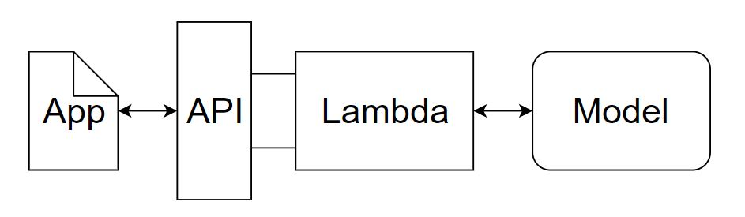
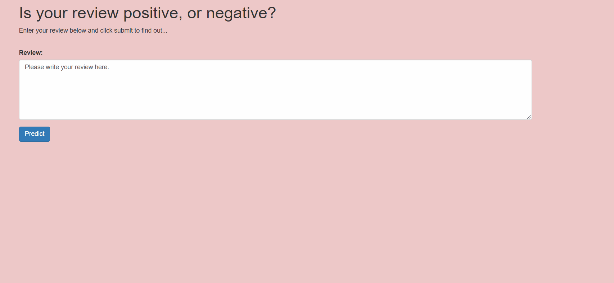

# Sentiment Analysis Web-app using AWS Sagemaker

A simple Web app for interacting with the Sentiment Analysis model using AWS Sagemaker for the purpose of determining the sentiment of a movie review using the IMDB data set. 

The diagram above gives an overview of how the various services will work together. On the far right is the model which we trained is deployed using SageMaker. On the far left is our web app that collects a user's movie review, sends it off and expects a positive or negative sentiment in return.

In the middle is where some of the magic happens. We will construct a Lambda function, which we can think of as a straightforward Python function that can be executed whenever a specified event occurs. We will give this function permission to send and recieve data from a SageMaker endpoint.

Lastly, the method we will use to execute the Lambda function is a new endpoint that we will create using API Gateway. This endpoint will be a url that listens for data to be sent to it. Once it gets some data it will pass that data on to the Lambda function and then return whatever the Lambda function returns. Essentially it will act as an interface that lets our web app communicate with the Lambda function.

#### A Positive Review Example

#### A Negative Review Example

